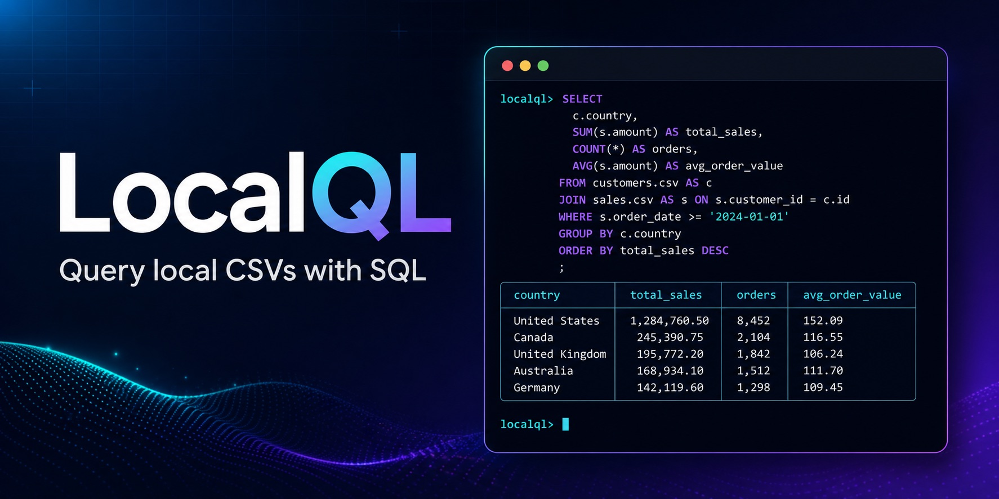

# LocalQL

[](https://github.com/highlordleonas/csvql/actions/workflows/ci.yml)
[](https://pypi.org/project/localql/)
[](https://pypi.org/project/localql/)
[](LICENSE)

LocalQL packages `csvql`, a lightweight DuckDB-powered CLI for querying local
CSV files with SQL. Use it when you want a repeatable local workflow: named
tables, saved SQL, readable output, explicit exports, and an optional terminal
menu.



## Contents

- [Quickstart](#quickstart)
- [Core workflows](#core-workflows)
- [Terminal menu](#terminal-menu)
- [Safety](#safety)
- [Documentation](#documentation)

## Quickstart

Install LocalQL:

```bash
pip install "localql[tui]"
```

Query one CSV:

```bash
csvql query examples/saas_revenue/data/revenue_movements.csv \
  "SELECT movement_type, SUM(mrr_delta) AS net_mrr_change
   FROM revenue_movements
   GROUP BY movement_type
   ORDER BY movement_type"
```


For a complete copy-and-paste walkthrough, see [Getting started](docs/getting-started.md).

## Core workflows

| When you want to… | Start here |
| --- | --- |
| Query a CSV or join named tables | [CLI reference](docs/cli-reference.md#query-csv-files) |
| Reuse a project catalog and saved SQL | [Project catalogs](docs/cli-reference.md#project-catalogs) |
| Inspect, sample, or profile a source | [Inspect-and-profile](docs/cli-reference.md#inspect-sample-and-profile) |
| Export a result or reuse it as a CSV source | [Save-and-reuse-results](docs/cli-reference.md#save-and-reuse-results) |
| Check configured data-quality rules | [Data-quality checks](docs/cli-reference.md#data-quality-checks) |

CSVQL does not implement a SQL engine. DuckDB executes SQL; CSVQL manages the
local workflow around table aliases, project configuration, output, and exports.

## Terminal menu

The optional `csvql menu` workbench provides sources, a SQL editor, results,
history, and explicit export actions in the terminal:

```bash
csvql menu
csvql menu /path/to/orders.csv
```


The CLI is the complete core workflow. See the [Terminal menu guide](docs/tui-guide.md)
for keys, source actions, history, and result handling.

## Safety

LocalQL treats user-authored SQL as trusted local DuckDB SQL. It does not
sandbox DuckDB or restrict filesystem access. Run only SQL you trust.

## Documentation

### Use LocalQL

- [Getting started](docs/getting-started.md)
- [CLI reference](docs/cli-reference.md)
- [Terminal menu guide](docs/tui-guide.md)
- [Troubleshooting](docs/troubleshooting.md)
- [FAQ](docs/faq.md)
- [SaaS revenue example](examples/saas_revenue/README.md)

### Reference

- [JSON output reference](docs/json-contracts.md)
- [Architecture](docs/ARCHITECTURE.md)
- [v1.0.0 release notes](docs/release-notes/v1.md)
- [Changelog](CHANGELOG.md)

### Project and support

- [Contributing](CONTRIBUTING.md)
- [Security](SECURITY.md)
- [Support](SUPPORT.md)
- [Code of Conduct](CODE_OF_CONDUCT.md)
