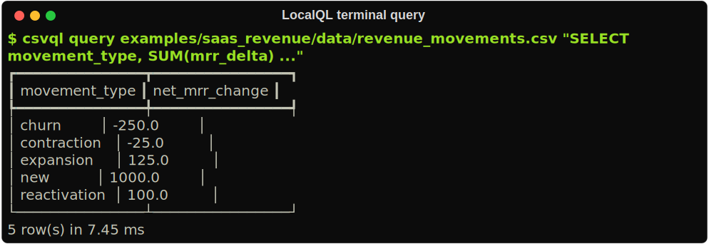
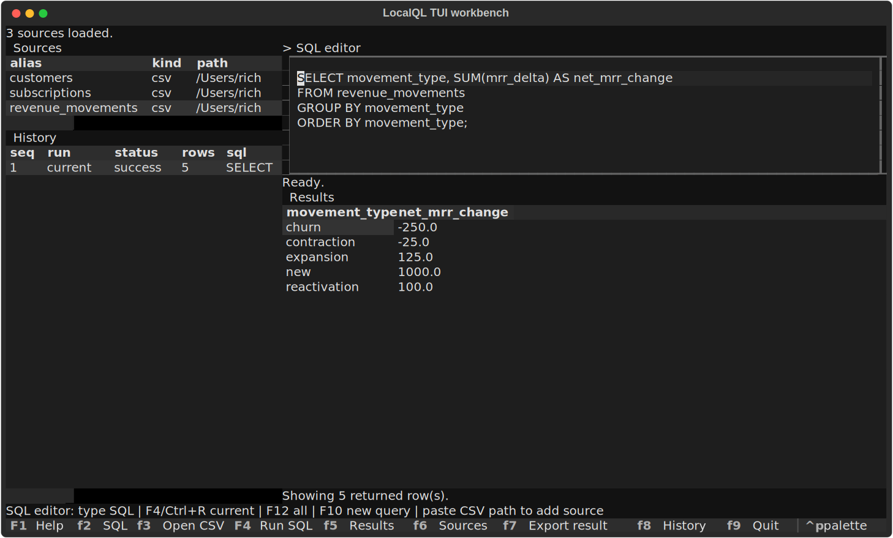

# LocalQL

LocalQL packages `csvql`, a lightweight DuckDB-powered CLI for querying local
CSV files like SQL tables. It is built for local analytics work where a small
project catalog, saved SQL, readable terminal output, and explicit exports are
more useful than a notebook or database service.

```bash
csvql query \
  --table customers=examples/saas_revenue/data/customers.csv \
  --table subscriptions=examples/saas_revenue/data/subscriptions.csv \
  "SELECT
      c.segment,
      COUNT(*) AS active_subscriptions,
      SUM(s.current_mrr) AS current_mrr
   FROM customers c
   JOIN subscriptions s USING (customer_id)
   WHERE s.status = 'active'
   GROUP BY c.segment
   ORDER BY current_mrr DESC"
```

CSVQL does not implement a SQL engine. DuckDB executes SQL; CSVQL owns the local workflow around table aliases, readable output, validation, and project catalog configuration.



## Quickstart

Install the distribution with the optional terminal workbench:

```bash
pip install "localql[tui]"
```

Then query one CSV with the installed `csvql` command:

```bash
csvql query examples/saas_revenue/data/revenue_movements.csv \
  "SELECT movement_type, SUM(mrr_delta) AS net_mrr_change
   FROM revenue_movements
   GROUP BY movement_type
   ORDER BY movement_type"
```

From a source checkout, use `uv run` instead:

```bash
uv sync --all-extras
uv run csvql --help
```

For the full copy/paste path, see [Getting started](docs/getting-started.md).

Two command modes matter:

- Using LocalQL: install once, then every command is `csvql ...`.
- Developing LocalQL: work from a source checkout with `uv run ...`.

## Status

This repository uses `localql` as the installable distribution name while
keeping `csvql` as the CLI command, Python import package, and project config
prefix. It has the core local workflow implemented for local CLI use:
query, inspect/sample, project catalogs, saved SQL, export, profile, configured
checks, doctor, benchmark and release-readiness proof scripts, JSON contract
documentation, the failure gallery, the polished example project, and the small
project-backed Python API. It also includes an optional Textual-powered terminal
menu for local interactive work. The release workflow and release-note material
now exist. The package version is `1.0.0`.

Public launch hygiene is still in `v1-hardening` until final proof is rerun on
the current release-candidate state. This work does not create a tag, PyPI
upload, GitHub release, artifact upload, external publication, or `v1-stable`
claim.

Implemented now:

- `csvql query --table name=path "SELECT ..."`
- `.csvql.yml` project catalog discovery
- `csvql init`
- `csvql add`
- `csvql tables`
- catalog-backed `csvql query "SELECT ... FROM alias"`
- `csvql inspect data/orders.csv --output json`
- `csvql sample data/orders.csv --limit 10`
- `csvql run queries/file.sql`
- `csvql export queries/file.sql --format csv|json|markdown --out path`
- catalog-backed `csvql inspect alias`
- catalog-backed `csvql sample alias`
- `csvql profile data/orders.csv --output json`
- catalog-backed `csvql profile alias`
- configured data-quality checks in `.csvql.yml`
- `csvql check [table] --output json`
- `csvql doctor --output json`
- sampled failure output with `csvql check --show-failures`
- repeated `--table` mappings for joins
- single-file shortcut mode
- optional `csvql menu` terminal workbench through the `tui` extra
- TUI startup from a project catalog, one CSV path, or repeated `--table`
  mappings
- TUI source actions for inspect, sample, profile, add, remove, and explicit
  project catalog save
- TUI query history for the current session only
- TUI explicit result export and explicit derived result sources under
  `.csvql/results/{alias}.csv`
- table and JSON stdout output
- DuckDB in-memory execution
- focused tests, Ruff, mypy, and GitHub Actions scaffolding

Repo-local hardening now:

- benchmark harness with JSON artifact and Markdown summary
- release-readiness verification for version consistency, build smoke, and installed-wheel smoke
- local output under `output/`

Current local proof evidence is generated under ignored `output/` directories
when the release-readiness and benchmark workflows are rerun.

## Install From Source

```bash
uv sync --all-extras
```

Run the CLI from the repo:

```bash
uv run csvql --help
```

Use the installed CLI examples throughout the public docs as `csvql ...`. When
you are developing from a source checkout, prefix those same commands with
`uv run`.

## First 10 Minutes

Start with the CLI path. Query one CSV, then decide whether you want the
optional terminal workbench.

```bash
csvql query examples/saas_revenue/data/revenue_movements.csv \
  "SELECT movement_type, SUM(mrr_delta) AS net_mrr_change
   FROM revenue_movements
   GROUP BY movement_type
   ORDER BY movement_type"
```

For repeatable work, initialize a project catalog, add sources once, and keep
SQL in files:

```bash
cd examples/saas_revenue
csvql tables
csvql run queries/revenue_health.sql --output json
```

Use `csvql menu` only when an interactive terminal workbench helps. The CLI
remains the complete core workflow.

## Interactive Terminal Menu

CSVQL can also run an optional Textual-powered terminal menu. For installed
usage, install the optional TUI dependency once:

```bash
pip install "localql[tui]"
```

Then launch the menu with `csvql`:

```bash
csvql menu
csvql menu /path/to/orders.csv
csvql menu --table customers=customers.csv --table orders=orders.csv
```



From a source checkout, use the repo-local environment:

```bash
uv sync --all-extras
uv run --all-extras csvql menu
```

The menu is session-backed by default. Sources added inside the TUI live only
for the current session unless you explicitly save them to a `.csvql.yml`
project catalog. Exports are written only when you choose the export action.

You can add sources after launch with `F3`, which opens a local CSV picker on
macOS. You can also paste `.csv` paths into the SQL editor. CSVQL turns pasted
CSV paths into session sources immediately.

The SQL editor is focused when the menu opens. Type SQL directly, then press
`F4` to run selected SQL. If nothing is selected, CSVQL falls back to the current
statement around the cursor. `F12` runs the whole editor when you want to
execute the complete SQL buffer.

Use `F2` or `Ctrl+Down` for the SQL editor, `F3` to choose CSV file(s), `F5`
for results, `F6` or `Ctrl+Up` for sources, and `F8` for history. Printable keys
type into SQL while the editor is focused. Source actions use letters only when
the source pane is focused: `i` inspect, `s` sample, `p` profile, `a` add, `d`
remove, and `w` save sources. In History, use `Enter` to reopen a query and `r`
to rerun a query against the current session sources. `?` opens help; `F1`
also works.

The Add source prompt accepts either `name=path` or pasted `.csv` path(s). Direct
path paste derives aliases from file names; duplicate aliases receive numeric
suffixes such as `orders_2`.

When the source pane is focused, Source Intelligence actions use `c` to
load/show columns, `l` to insert the selected source alias, and `x` to insert a
`SELECT *` starter query. Column metadata is session-local and is not written to
`.csvql.yml`.

`Ctrl+N` or `F10` clears the editor for a new query while keeping history and
the last result view visible. Query history is in-memory session state only: it
is not written to disk, logged, or sent anywhere by CSVQL, and it clears when
the TUI exits.

`Ctrl+S` saves the last successful tabular query result as a derived source.
`Alt+S` is also bound for terminals that emit Alt key events, and `F11` is
available where it is not intercepted by the OS. macOS may intercept `F11` for
Show Desktop. CSVQL prompts for an alias, writes
`.csvql/results/{alias}.csv`, and adds that alias to the Sources pane with kind
`derived` so it can be queried or joined later in the same TUI session. The CSV
file remains on disk; the alias becomes durable across TUI sessions only if you
explicitly save sources to `.csvql.yml`. Derived result sources are explicit
CSV-backed artifacts, not hidden cache or automatic materialization. They use
the same trusted local DuckDB SQL posture as other CSVQL sources.

The SQL editor uses the same trusted local DuckDB execution posture as the rest
of CSVQL. Do not run untrusted SQL.

See [Terminal menu guide](docs/tui-guide.md) for a focused walkthrough of the
panes, keybindings, and derived result source workflow.

## Python API Example

CSVQL also exposes a project-backed Python API:

```python
from pathlib import Path

from csvql import CSVQLSession

session = CSVQLSession.from_config("examples/saas_revenue")

tables = session.tables()
sample = session.sample("revenue_movements", limit=5)
profile = session.profile("revenue_movements")
result = session.run_file("queries/revenue_health.sql")
Path("examples/saas_revenue/output").mkdir(parents=True, exist_ok=True)
output_path = session.export(
    "queries/revenue_health.sql",
    "output/revenue-health.json",
    format="json",
    force=True,
)

for row in result.as_records():
    print(row)
```

The Python API is intentionally project-backed: table listing, trusted SQL,
saved SQL files, inspect, sample, profile, configured checks, and export. It
does not provide direct-path sessions, ad hoc table mappings, config mutation,
dataframe helpers, async execution, plugins, or a second execution engine.

## Query Examples

Query one CSV with the single-file shortcut. The table name is derived from the file stem, so `revenue_movements.csv` becomes `revenue_movements`.

```bash
csvql query examples/saas_revenue/data/revenue_movements.csv \
  "SELECT movement_type, SUM(mrr_delta) AS net_mrr_change
   FROM revenue_movements
   GROUP BY movement_type
   ORDER BY movement_type"
```

Query multiple CSV files:

```bash
csvql query \
  --table customers=examples/saas_revenue/data/customers.csv \
  --table subscriptions=examples/saas_revenue/data/subscriptions.csv \
  "SELECT
      c.customer_id,
      c.company_name,
      s.plan_name,
      s.current_mrr
   FROM customers c
   JOIN subscriptions s USING (customer_id)
   WHERE s.status = 'active'
   ORDER BY s.current_mrr DESC"
```

Return JSON for automation:

```bash
csvql query \
  --table revenue_movements=examples/saas_revenue/data/revenue_movements.csv \
  --output json \
  "SELECT movement_month, SUM(mrr_delta) AS net_mrr_change
   FROM revenue_movements
   GROUP BY movement_month
   ORDER BY movement_month"
```

## Project Catalog Examples

Initialize a local project catalog:

```bash
csvql init
```

Register a table once:

```bash
csvql add revenue_movements examples/saas_revenue/data/revenue_movements.csv
```

List registered tables as JSON:

```bash
csvql tables --output json
```

Query a registered table by alias:

```bash
csvql query "SELECT COUNT(*) AS movement_count FROM revenue_movements"
```

For one invocation, explicit `--table` mappings still work and override catalog aliases with the same name.

```bash
csvql query \
  --table revenue_movements=examples/saas_revenue/data/revenue_movements.csv \
  "SELECT COUNT(*) AS movement_count FROM revenue_movements"
```

## Saved Workflow Examples

Run SQL from a file using catalog aliases:

```bash
cd examples/saas_revenue
csvql run queries/revenue_health.sql --output json
```

Inspect a registered catalog alias and profile it:

```bash
cd examples/saas_revenue
csvql inspect revenue_movements --output json
csvql profile revenue_movements --output json
```

Export the main analysis:

```bash
cd examples/saas_revenue
mkdir -p output
csvql export queries/revenue_health.sql \
  --format json \
  --out output/revenue-health.json \
  --force

csvql export queries/revenue_health.sql \
  --format markdown \
  --out output/revenue-health.md \
  --force
```

See `examples/saas_revenue/README.md` for the full copy/paste walkthrough.

## Reusable Result Sources

You can turn a saved SQL result into a reusable CSV source without opening the
TUI. This is normal CSV reuse: export a result, add the exported CSV as a table
alias, then query it like any other CSVQL source.

```bash
cd examples/saas_revenue
mkdir -p .csvql/results
csvql export queries/revenue_health.sql \
  --format csv \
  --out .csvql/results/revenue_health.csv \
  --force

csvql add revenue_health_result .csvql/results/revenue_health.csv --replace
csvql query "SELECT COUNT(*) AS result_rows FROM revenue_health_result"
```

For one command without catalog persistence, pass the exported result with
`--table`:

```bash
cd examples/saas_revenue
csvql query \
  --table revenue_health_result=.csvql/results/revenue_health.csv \
  "SELECT * FROM revenue_health_result"
```

This CLI path is practical parity with the TUI's Save Result As Source action,
but it is not a typed derived-source catalog feature. The current project
catalog stores table paths; it does not store source-kind metadata.

## Inspect And Sample Examples

Inspect the core revenue-movement table:

```bash
csvql inspect examples/saas_revenue/data/revenue_movements.csv --output json
```

Calculate an exact row count when you explicitly want a full scan:

```bash
csvql inspect examples/saas_revenue/data/revenue_movements.csv --exact --output json
```

Sample rows from the same table:

```bash
csvql sample examples/saas_revenue/data/revenue_movements.csv --limit 5
```

## Profile Examples

Profile the revenue-movement CSV with a full scan:

```bash
csvql profile examples/saas_revenue/data/revenue_movements.csv
```

Return JSON profile metrics:

```bash
csvql profile examples/saas_revenue/data/revenue_movements.csv --output json
```

Profile a registered catalog alias:

```bash
cd examples/saas_revenue
csvql profile revenue_movements --output json
```

`csvql profile` reports row and column counts, duplicate row count, per-column null counts and percentages, non-null counts, distinct counts excluding nulls, and DuckDB `min`/`max` values. String `min` and `max` use DuckDB lexicographic ordering.

## Data Quality Check Examples

Configure checks in `.csvql.yml`:

```yaml
version: 1
tables:
  customers:
    path: data/customers.csv
    checks:
      - name: customer_id_required
        type: not_null
        column: customer_id
      - name: customer_id_unique
        type: unique
        column: customer_id
  subscriptions:
    path: data/subscriptions.csv
    checks:
      - name: subscription_id_required
        type: not_null
        column: subscription_id
      - name: subscription_id_unique
        type: unique
        column: subscription_id
      - name: subscription_customer_exists
        type: foreign_key
        column: customer_id
        references:
          table: customers
          column: customer_id
  revenue_movements:
    path: data/revenue_movements.csv
    checks:
      - name: movement_id_required
        type: not_null
        column: movement_id
      - name: movement_id_unique
        type: unique
        column: movement_id
      - name: movement_type_known
        type: accepted_values
        column: movement_type
        values: [new, expansion, contraction, churn, reactivation]
```

Run all configured checks:

```bash
csvql check
```

Run checks for one registered table and return JSON:

```bash
csvql check revenue_movements --output json
```

Include capped failure samples:

```bash
csvql check revenue_movements --output json --show-failures --failure-limit 5
```

`csvql check` exits `0` when checks pass or no checks are configured. It exits `11` when configured checks run successfully and find data-quality failures. Missing catalogs, missing files, invalid config, and DuckDB execution errors use the existing CLI error path.

## Project Health Examples

Run project doctor from a directory with a `.csvql.yml` project catalog:

```bash
csvql doctor
```

Return doctor results as JSON for automation:

```bash
csvql doctor --output json
```

`csvql doctor` exits `0` for `passed` and `warning` results. It exits `12` when the
project catalog exists but CSVQL finds concrete project-health failures such as invalid
config, missing configured CSV files, unreadable CSV inputs, or configured checks that
reference missing columns.

## Benchmark And Release Hardening

Generate local benchmark evidence:

- `uv run python scripts/benchmark_csvql.py --output-root output/benchmarks`

Verify build and install proof:

- `uv run python scripts/verify_release_readiness.py --work-dir output/release-readiness`

Release workflow and notes:

- [Changelog](CHANGELOG.md)
- [v1 release notes](docs/release-notes/v1.md)
- [Release readiness](docs/release-readiness.md)

Claims boundary:

- Local benchmark evidence only
- No large-file proof beyond the recorded datasets
- No production-readiness claim
- No sandbox-safety claim
- No publish, tag, or upload action without separate explicit approval

## Development Checks

```bash
uv run ruff format --check .
uv run ruff check .
uv run --all-extras mypy src
uv run --all-extras pytest
```

Or run the combined local gate:

```bash
make ci
```

## Security Model

CSVQL is currently a local developer tool for trusted SQL. DuckDB executes the SQL, and CSVQL does not sandbox DuckDB, restrict DuckDB capabilities, or restrict filesystem access. Do not run untrusted SQL files or input.

## Documentation

- [Getting started](docs/getting-started.md)
- [FAQ](docs/faq.md)
- [Troubleshooting](docs/troubleshooting.md)
- [Terminal menu guide](docs/tui-guide.md)
- [SaaS revenue example](examples/saas_revenue/README.md)
- [Architecture](docs/ARCHITECTURE.md)
- [Benchmarking](docs/benchmarking.md)
- [Changelog](CHANGELOG.md)
- [JSON contracts](docs/json-contracts.md)
- [Failure gallery](docs/failure-gallery.md)
- [Release readiness](docs/release-readiness.md)
- [v1 release notes](docs/release-notes/v1.md)
- [Roadmap](docs/ROADMAP.md)
- [Contributing](CONTRIBUTING.md)
- [Security](SECURITY.md)
- [Support](SUPPORT.md)
- [Development](docs/development.md)

Maintainer-facing docs:

- [Manual v1 QA matrix](docs/v1-manual-qa.md)
- [Product direction](docs/PRODUCT_DIRECTION.md)
