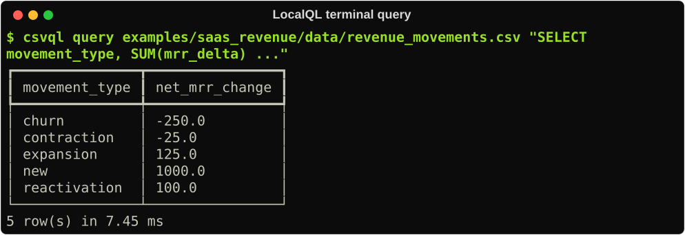

# Getting Started

This guide uses the installed `csvql` command. LocalQL is the package name;
`csvql` is the command, Python import package, and `.csvql.yml` configuration
namespace.

## Install LocalQL

Install the core CLI in the Python environment you use for local analysis:

```console
python -m pip install localql
csvql --version
```

If `csvql` is not found after installation, see
[Troubleshooting](troubleshooting.md#csvql-command-not-found).

## Query your first source

Put a CSV in your working directory. For example, create `orders.csv` with a
header row and a few rows of data, then run:

```console
csvql query orders.csv "SELECT * FROM orders LIMIT 5"
```

The file stem becomes the table name: `orders.csv` is available as `orders`.
The command prints a result table. Use `--output json` when a script needs a
structured result.



## Query other local formats

Recognized extensions select their provider deterministically:

```console
csvql query data/orders.parquet "SELECT COUNT(*) FROM orders"
csvql query data/events.ndjson "SELECT event_type, COUNT(*) FROM events GROUP BY event_type"
csvql query data/customers.json "SELECT * FROM customers LIMIT 5"
```

CSV, Parquet, JSON, and NDJSON use the same query path. Excel `.xlsx` workbooks
use the same path when DuckDB's optional `excel` extension has already been
provisioned in the environment:

```console
csvql query data/orders.xlsx "SELECT * FROM orders LIMIT 5" \
  --type excel \
  --option sheet=Orders \
  --option range=A1:F500
```

LocalQL does not install optional DuckDB extensions while a command is running.
If a dependency is missing, the diagnostic identifies it and tells you what
must be provisioned.

An explicit type always wins. Use one for extensionless files and directories:

```console
csvql query data/order_facts "SELECT COUNT(*) FROM order_facts" \
  --type parquet \
  --option partitioning=hive
```

LocalQL never recursively guesses a directory's format. Without an explicit
type, bounded identification may list candidates, but it will require you to
choose before any adapter is constructed.

## Understand previews and complete outputs

Interactive table output from `csvql query` and `csvql run` retains up to 1,000
rows by default. Use `--limit` to choose a smaller or larger table-preview
bound:

```console
csvql query orders.csv "SELECT * FROM orders" --limit 25
```

The bound applies only to human-readable table output. Query/run JSON output
and Python API results remain complete, and `csvql export` writes the complete
result to a file.

## Use a project catalog

For repeated work in a directory, initialize a catalog and register a friendly
table name:

```console
csvql init
csvql add orders data/orders.parquet --type parquet
csvql add events data/events.ndjson --type ndjson
csvql tables
csvql query "SELECT status, COUNT(*) AS order_count FROM orders GROUP BY status"
```

`csvql init` creates a version 2 catalog. It stores explicit source intent,
rather than inferred runtime facts:

```yaml
version: 2
tables:
  orders:
    source:
      type: parquet
      locator: data/orders.parquet
  events:
    source:
      type: ndjson
      locator: data/events.ndjson
```

Pass `--option key=value` to `csvql add` when a source needs explicit provider
options. Existing version 1 catalogs remain valid and CSV-only; LocalQL does
not silently migrate or rewrite them. The catalog does not upload data, inspect
sources in the background, or run queries automatically.

## Run saved SQL and export results

Keep a repeatable query in a file, then run or export it explicitly:

```console
csvql run queries/orders_by_status.sql --output json
csvql export queries/orders_by_status.sql --format csv --out orders_by_status.csv
```

Use `--force` only when you intend to replace an existing export.

## Use the optional terminal menu

After your first core query, install the optional terminal-menu extra when you
want an interactive source list, SQL editor, results, and history:

```console
python -m pip install "localql[tui]"
csvql menu orders.csv
```

You can also start with `csvql menu` and run source-free SQL such as `SELECT 1`
before loading any sources.

The menu keeps legacy CSV paste and picker behavior. Press `a`, or paste a
recognized non-CSV path, to open the structured source flow with alias, locator,
type, options, bounded detection evidence, and confirmation. See the
[Terminal menu guide](tui-guide.md) for keys and source actions.


## Compatibility and SQL safety

LocalQL supports Python 3.11 through 3.14 on macOS, Linux, and Windows.

User-authored SQL is trusted local DuckDB SQL. LocalQL does not sandbox DuckDB
or restrict filesystem access, so run only SQL you trust.

## Next steps

- Use the [CLI reference](cli-reference.md) for command options and JSON output.
- Use [Troubleshooting](troubleshooting.md) when a command or project does not work as expected.
- Read the [FAQ](faq.md) for package naming, compatibility, and TUI questions.
- Visit [Support](../SUPPORT.md) for bugs, documentation issues, and focused feature requests.
