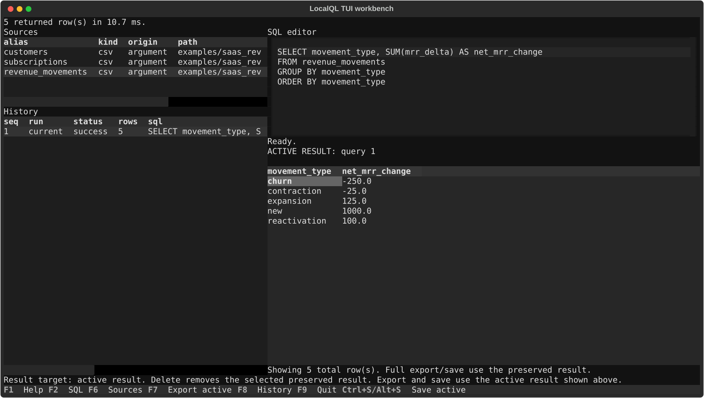

# LocalQL Workbench Guide

`csvql menu` is an optional Textual-powered terminal workbench for the same
local CSV, Parquet, JSON, NDJSON, and Excel sources and trusted SQL used by the
CLI. It is useful when you want to iterate in a terminal without repeatedly
retyping source mappings.

## Launch

Install the optional terminal-menu extra first:

```console
python -m pip install "localql[tui]"
csvql menu
```

Launch with one CSV, or repeat `--table` to load several named CSVs:

```console
csvql menu revenue_movements.csv
csvql menu --table customers=customers.csv --table orders=orders.csv
```

Launching without a CSV is supported. With no sources loaded, you can still run
source-free DuckDB SQL such as `SELECT 1`, then add sources later from the
Sources pane.

The menu retains up to 1,000 preview rows and uses one 1 GiB result-storage
capacity by default. Override those session settings with `--limit` and
`--spool-capacity-mib`:

```console
csvql menu --limit 250 --spool-capacity-mib 512
```

You can add sources after launch with `F3`. On macOS it opens a native source
picker; `Ctrl+O` retains the portable path-entry fallback. You can also paste a
standalone path into the SQL editor. A `.csv` path keeps the low-friction
behavior and is added immediately. A recognized non-CSV path, extensionless
file, or directory opens the structured source flow. Paths inside SQL strings,
comments, or expressions remain ordinary SQL text.



## Panes

The menu opens with the SQL editor focused.

- SQL editor: write selected SQL, the current statement, or the full buffer
- Sources: inspect, sample, profile, add, remove, and save source mappings
- Results: view the latest or recalled tabular result; `[` and `]` move between
  buffer results when Results is focused
- History: recall results, reopen queries, or rerun queries from the current session
- Help: view available keybindings inside the app

## Core Keys

| Key | Action |
| --- | --- |
| `F4` or `Ctrl+R` | Run selected SQL or the current statement |
| `F7` | Export active result |
| `F12` or `Ctrl+B` | Run the buffer as separate History rows |
| `F2` or `Ctrl+Down` | Focus SQL editor |
| `F3` or `Ctrl+O` | Choose local source file(s) or prompt for a path |
| `F5` | Focus results |
| `F6` or `Ctrl+Up` | Focus sources |
| `F8` | Focus history |
| `F9` or `q` | Quit outside text entry |
| `F1` | Help |
| `Ctrl+N` or `F10` | Clear editor for a new query |

`F4` or `Ctrl+R` runs the selected or current statement in a fresh DuckDB
session. `F12` or `Ctrl+B` runs the editor's semicolon-delimited statements in
one shared session, so earlier temporary tables can feed later statements in
that buffer.

The History run column labels entries as `current` for F4/Ctrl+R runs,
`buffer` for F12/Ctrl+B runs, and `rerun` for History reruns.

The full workbench needs at least 100 columns by 30 rows. A 120x36 terminal is
recommended.

## Result Previews And Session Capacity

Each tabular query displays a retained preview of up to 1,000 rows and 16 MiB
by default. LocalQL preserves the complete result in private temporary storage
at the same time, allowing History, export, and save actions to use every row
without rerunning the query.

Complete results share one 1 GiB session capacity by default. LocalQL uses no
automatic eviction: earlier preserved results stay available until you remove
one from History or exit the menu. If a new result cannot fit in the remaining
capacity, LocalQL keeps its retained preview as a preview-only result and says
that full export and save are unavailable for that result.

Deleting a preserved result releases only that result's session capacity. To
make room for a later complete result, focus History with `F8`, highlight an
older preserved result, press `Delete`, confirm the deletion, and rerun the
preview-only query.

The capacity applies to result preservation, not source files. Temporary result
storage is private to the running menu session and is cleaned up when the menu
exits.

## Source Actions

When the Sources pane is focused:

| Key | Action |
| --- | --- |
| `i` | Inspect selected source and load columns |
| `s` | Sample selected source |
| `p` | Profile selected source |
| `a` | Add structured source intent |
| paste `.csv` paths | Add CSV path text immediately |
| paste another local path | Open the structured source flow |
| `d` | Remove selected source from the session after confirmation |
| `w` | Save current sources to `.csvql.yml` |
| `c` | Load or show source columns |
| `l` | Insert selected source alias into SQL |
| `x` | Open starter SQL templates |

The structured Add source flow collects an alias, file or directory locator,
source type, and space-separated `key=value` options. Auto selection uses only
a recognized extension. Before adding the source, the menu shows the selected
provider and deterministic evidence and asks for confirmation.

Use lowercase `true` or `false` for Boolean options. For example, an Excel
source can use `sheet=Orders range=A1:F500 type_mode=text`. The
[source provider options](cli-reference.md#source-provider-options) reference
lists every accepted option and default. Excel must be
[provisioned explicitly](getting-started.md#provision-excel-support) before the
menu can open a workbook.

An extensionless file or directory may produce bounded candidate evidence, but
LocalQL will not choose a provider from that evidence. The flow reopens so you
can select CSV, Parquet, JSON, NDJSON, or Excel explicitly. No directory is
recursively scanned to guess its type.

Legacy direct `.csv` path paste derives aliases from file names, and duplicate
aliases receive numeric suffixes such as `orders_2`. Added sources are
session-local until you save sources to `.csvql.yml`.

Saving sources to `.csvql.yml` may persist local filesystem paths. Project-relative
paths are portable; external absolute paths and symlink-resolved paths outside the
start directory are allowed for local workflows but can reveal machine-specific
locations if you share the catalog.

Version 2 catalogs persist the explicit type, locator, and only the options you
entered. Existing version 1 catalogs remain CSV-only; attempting to save
non-CSV or option-bearing source intent reports migration guidance and performs
no write.

Column details and detection evidence stay in the current session and are not
written to `.csvql.yml`.
`x` always offers preview rows and row count, and column-aware templates appear
after `c` or `i` loads metadata. In the SQL editor, `Tab` is the primary
SQL-editor completion key. When completion items are available, it opens
the completion list; otherwise it inserts four spaces and keeps focus in
the SQL editor. `Ctrl+Space` remains available where the terminal delivers it.
Generated SQL is editable and does not execute automatically. Pane focus stays
on `F2`, `F5`, `F6`, and `F8`.

## History

History is in-memory session state. It is not written to disk, logged, or sent
anywhere by LocalQL.

When the History pane is focused:

- highlighting a row recalls its result in Results
- `Enter` reopens a query in the editor
- `r` reruns a query against the current session sources
- `Delete` removes the selected preserved result after confirmation and releases
  any session capacity allocated to it

History clears when the TUI exits.

## Export Active Result

Press `F7` to export the active tabular result shown in Results. LocalQL prompts
for a file path. The file suffix chooses the format: `.csv`, `.json`,
`.ndjson`/`.jsonl`, `.parquet`/`.parq`, `.xlsx`, `.md`/`.markdown`, or `.txt`.
If the path has no suffix, LocalQL writes `.csv` by default.

When a complete result was preserved, the export contains every row rather than
only the retained preview. Export is unavailable for a preview-only result, and
the menu reports why instead of writing a partial file.

Parquet export uses the preserved DuckDB column types. NDJSON writes one object
per row. Excel export requires an already-provisioned DuckDB `excel` extension
and follows its spreadsheet type conversions. The menu never reruns the query
to create an export.

Relative export paths are resolved from the directory where you launched
`csvql menu`.

## Save A Result As A Source

After a successful tabular query, press `Ctrl+S` to save the active tabular
result as a derived CSV source. `Alt+S` is also available where terminals emit Alt key
events, and `F11` is available where the OS does not intercept it. macOS may
reserve `F11` for Show Desktop.

LocalQL prompts for an alias, writes `.csvql/results/{alias}.csv`, and adds the
alias to the current Sources pane with kind `derived`.

Save uses the complete preserved result. It is unavailable for a preview-only
result so LocalQL never presents a partial source as complete.

The CSV file remains on disk. The alias becomes durable across TUI sessions only
if you explicitly save sources to `.csvql.yml`.

## Important Behavior

- The terminal menu follows the same SQL safety rules as the CLI: run only SQL
  you trust.
- Saving a result as a source creates a normal CSV file. LocalQL does not create
  a hidden result cache.
- The terminal menu is optional; all core commands are also available from the
  CLI.
