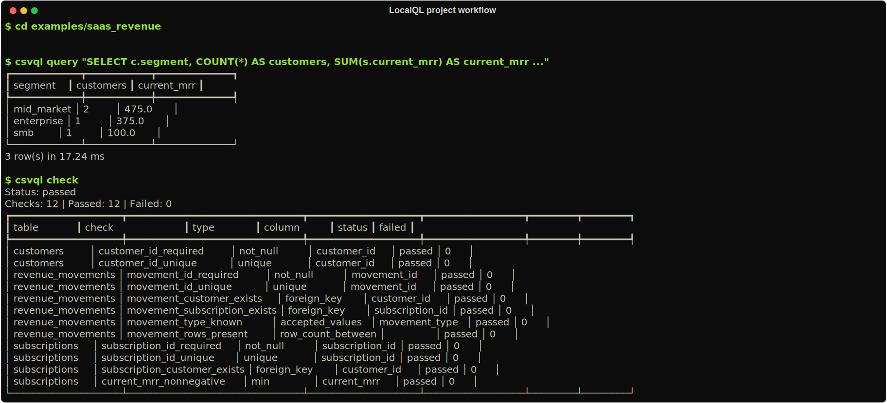

# SaaS Revenue Example

This example models a small local B2B SaaS revenue project with three CSVs:

- `customers.csv`
- `subscriptions.csv`
- `revenue_movements.csv`

It is the primary copy/paste example for LocalQL v1. The goal is to show that
the `csvql` CLI can inspect a project, validate it, run a saved analysis, and
export results for both automation and human review.

## Quickstart

```bash
cd examples/saas_revenue

csvql inspect data/revenue_movements.csv --output json
csvql profile revenue_movements --output json
csvql check --output json
csvql run queries/revenue_health.sql --output json
csvql export queries/revenue_health.sql --format json --out output/revenue-health.json --force
csvql export queries/revenue_health.sql --format markdown --out output/revenue-health.md --force
```

Expected shape:

- `inspect` prints the detected columns, dialect, file metadata, and row-count
  mode.
- `profile` prints row/column counts, null counts, duplicate count, and simple
  per-column summaries.
- `check` exits `0` when the configured project checks pass.
- `run` returns four monthly revenue-health rows.
- `export` writes JSON and Markdown files under `output/`.



## What The Outputs Prove

- `inspect` shows the raw shape of a core project table
- `profile` shows row counts, duplicate counts, and column-level completeness
- `check` validates project health from `.csvql.yml`
- `run` returns the canonical revenue-health readout as JSON
- `export` writes the same analysis to machine-readable JSON and a Markdown sidecar

## Main Analysis

`queries/revenue_health.sql` returns one row per month with:

- starting MRR
- new MRR
- expansion MRR
- contraction MRR
- churn MRR
- reactivation MRR
- ending MRR
- ending ARR
- net revenue retention percentage

The result is meant to be small enough to inspect in a terminal and structured
enough to export into another local workflow.

## Regenerate The Data

The committed CSVs are intentional and reproducible. To rewrite them exactly:

```bash
cd examples/saas_revenue
uv run python scripts/regenerate_data.py
```

The script rewrites only the files under `data/`.
